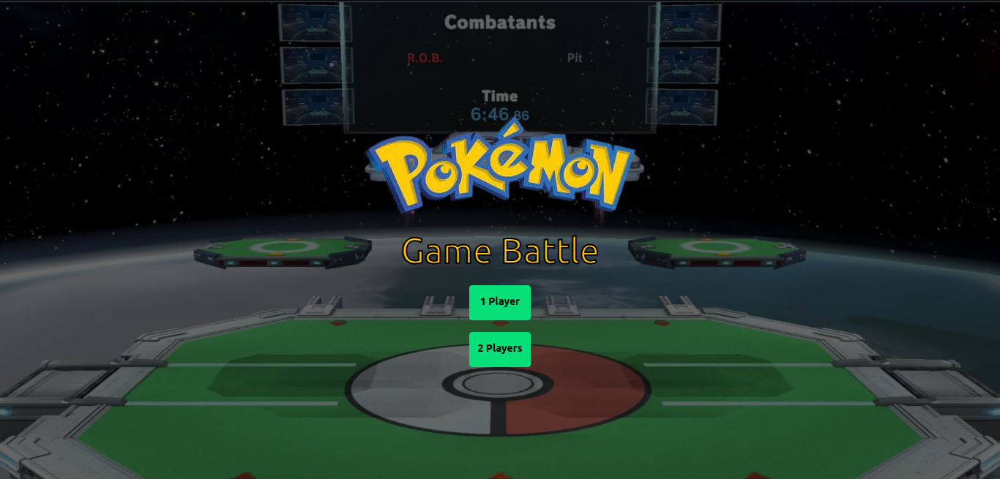
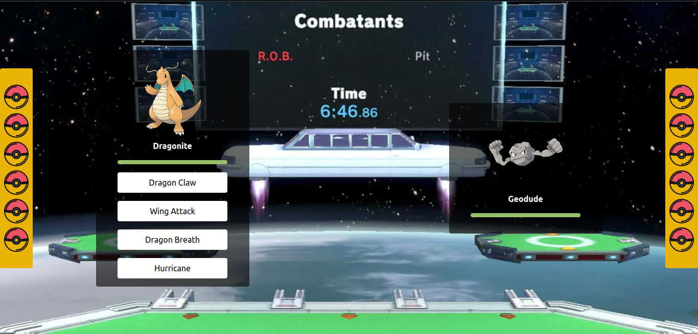

# Pokemon Game Dev
Game created for POO school discipline in Unijorge 

## Version of Game: 
1.9

## How to Run
To clone and upload the application, you need Git, Node.js installed on your machine.

```bash
git clone https://github.com/LasVacasDelBresil/Unijorgemon/tree/FilipeMarques
cd Unijorgemon/v1
npm i
npm run dev
```

## Images
Home:


Battle:


## Read The Rules
[Rules](./README-DEV.MD)

## :four_leaf_clover: Technologies used
This project is being developed with the following technologies.

-   [TypeScript](https://www.typescriptlang.org/docs/)
-   [Node](https://nodejs.org/)
-   [Vite](https://vitejs.dev/)
-   [Tailwindcss](https://tailwindcss.com/)


